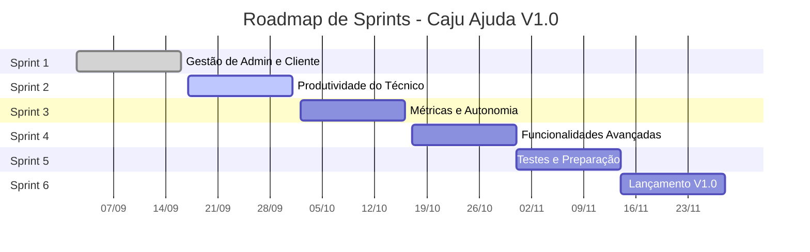

#  Caju Ajuda - Sistema de Helpdesk (.NET)

O **Caju Ajuda** é uma solução de suporte e gerenciamento de tickets (helpdesk) completa, projetada com uma arquitetura moderna API-First para servir múltiplos clientes. O backend, construído em C# com ASP.NET Core, serve como o cérebro da operação para clientes Web, Mobile (React Native) e Desktop (.NET MAUI).

---

### **Documentação e Planejamento**

* **[📈 Product Backlog](./documentacao/Backlog.md)**: A lista completa de funcionalidades, épicos e user stories do projeto.
* **[📅 Roadmap de Sprints](./documentacao/sprint.md)**: O cronograma detalhado de cada Sprint, com objetivos e escopo de entrega.
* **[📚 Pasta de Documentação](./docs/)**: Acesso a todos os artefatos do projeto, incluindo diagramas, manuais e definições.

---

### **Cronograma Visual de Evolução**
O roadmap abaixo apresenta uma visão geral do planejamento de Sprints para a entrega da Versão 1.0.

---

### **Tecnologias Utilizadas**
* **Backend:** C# 12, ASP.NET Core 8, Entity Framework Core 8, JWT Bearer Authentication
* **Frontend:** .NET MAUI, React com TypeScript, React Native
* **Banco de Dados:** MS SQL Server
* **Inteligência Artificial:** Google Gemini API
* **Ferramentas:** Git, Visual Studio Code, SQL Server Management Studio, Bruno

---

### **Como Executar o Projeto**

#### Pré-requisitos
* .NET 8 SDK
* Node.js e npm
* SQL Server (Developer ou Express Edition)

#### Execução
1.  **Backend:** Navegue até `src/backend` e execute `dotnet run`. A API iniciará em `https://localhost:7113`.
2.  **Web:** Navegue até `src/web` e execute `npm start`. A aplicação web iniciará em `http://localhost:3000`.

*(Para instruções detalhadas sobre os clientes Desktop e Mobile, consulte os READMEs específicos em suas respectivas pastas).*

---

### **Equipe**

| Foto | Nome Completo | Papel | Contato |
| :--- | :--- | :--- | :--- |
|  | Davi Matos Marques Silva | Desenvolvedor Full-Stack & Arquiteto do Projeto | [LinkedIn](URL_DO_SEU_LINKEDIN_AQUI) |
