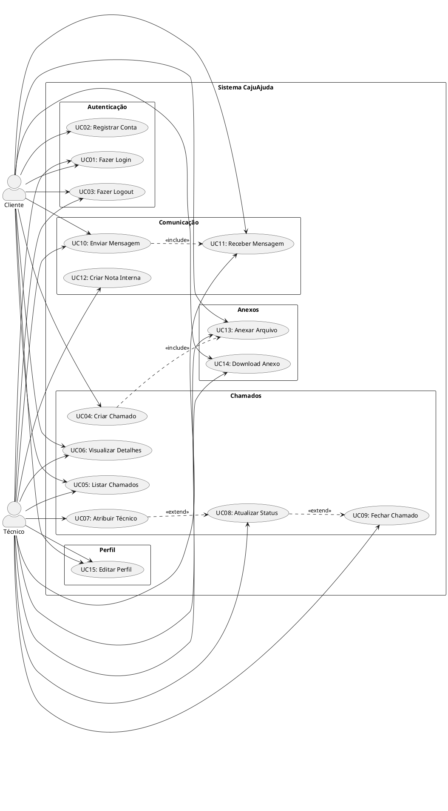

# 3. MODELO DE CASOS DE USO (MCU)

## 3.1 DESCRIÇÃO DO MODELO

O Modelo de Casos de Uso representa as funcionalidades do sistema CajuAjuda sob a perspectiva dos usuários (atores). O sistema possui 3 atores principais e 15 casos de uso organizados em 5 subsistemas funcionais.

---

## 3.2 ATORES DO SISTEMA

### 🧑 **Cliente**
- **Descrição**: Usuário final que solicita suporte técnico
- **Responsabilidades**: Criar chamados, enviar mensagens, anexar arquivos, visualizar status
- **Restrições**: Não pode atribuir técnicos, não pode ver notas internas

### 👨‍💻 **Técnico**
- **Descrição**: Profissional de suporte que resolve chamados
- **Responsabilidades**: Atribuir-se a chamados, responder clientes, criar notas internas, alterar status
- **Restrições**: Não pode deletar chamados de outros técnicos

### 👔 **Administrador**
- **Descrição**: Gestor do sistema com acesso total
- **Responsabilidades**: Gerenciar usuários, visualizar relatórios, configurar sistema
- **Restrições**: Não implementado na versão atual (planejado para v2.0)

---

## 3.3 CASOS DE USO

### **SUBSISTEMA 1: Autenticação**

#### UC01 - Fazer Login
- **Ator**: Cliente, Técnico
- **Pré-condição**: Usuário possui cadastro no sistema
- **Fluxo Principal**:
  1. Usuário acessa tela de login
  2. Usuário informa email e senha
  3. Sistema valida credenciais
  4. Sistema gera token JWT
  5. Sistema redireciona para dashboard
- **Fluxo Alternativo**: Credenciais inválidas → Exibe mensagem de erro
- **Pós-condição**: Usuário autenticado com token válido

#### UC02 - Registrar Conta
- **Ator**: Cliente
- **Pré-condição**: Email não cadastrado
- **Fluxo Principal**:
  1. Usuário acessa tela de registro
  2. Usuário informa nome, email e senha
  3. Sistema valida dados
  4. Sistema cria usuário com perfil "Cliente"
  5. Sistema autentica automaticamente
- **Pós-condição**: Novo usuário cadastrado e autenticado

#### UC03 - Fazer Logout
- **Ator**: Cliente, Técnico
- **Pré-condição**: Usuário autenticado
- **Fluxo Principal**:
  1. Usuário clica em "Sair"
  2. Sistema invalida token
  3. Sistema redireciona para login
- **Pós-condição**: Sessão encerrada

---

### **SUBSISTEMA 2: Gerenciamento de Chamados**

#### UC04 - Criar Chamado
- **Ator**: Cliente
- **Pré-condição**: Cliente autenticado
- **Fluxo Principal**:
  1. Cliente acessa "Novo Chamado"
  2. Cliente preenche título e descrição
  3. Cliente seleciona prioridade
  4. (Opcional) Cliente anexa arquivos
  5. Sistema cria chamado com status "Aberto"
  6. Sistema notifica técnicos disponíveis
- **Pós-condição**: Chamado criado e disponível para atribuição
- **Relacionamento**: «include» UC09 (Anexar Arquivo)

#### UC05 - Listar Chamados
- **Ator**: Cliente, Técnico
- **Pré-condição**: Usuário autenticado
- **Fluxo Principal**:
  1. Usuário acessa dashboard
  2. Sistema lista chamados conforme perfil:
     - Cliente: Apenas seus chamados
     - Técnico: Todos os chamados
  3. Sistema permite filtrar por status
- **Pós-condição**: Lista de chamados exibida

#### UC06 - Visualizar Detalhes do Chamado
- **Ator**: Cliente, Técnico
- **Pré-condição**: Chamado existe
- **Fluxo Principal**:
  1. Usuário clica em um chamado
  2. Sistema exibe detalhes completos
  3. Sistema exibe histórico de mensagens
  4. Sistema exibe anexos
- **Pós-condição**: Detalhes visualizados

#### UC07 - Atribuir Técnico ao Chamado
- **Ator**: Técnico
- **Pré-condição**: Chamado sem técnico atribuído
- **Fluxo Principal**:
  1. Técnico acessa chamado disponível
  2. Técnico clica em "Atribuir a Mim"
  3. Sistema associa técnico ao chamado
  4. Sistema atualiza status para "Em Andamento"
  5. Sistema notifica cliente
- **Pós-condição**: Chamado atribuído ao técnico
- **Relacionamento**: «extend» UC08 (Atualizar Status)

#### UC08 - Atualizar Status do Chamado
- **Ator**: Técnico
- **Pré-condição**: Técnico responsável pelo chamado
- **Fluxo Principal**:
  1. Técnico acessa chamado
  2. Técnico seleciona novo status
  3. Sistema valida transição de status
  4. Sistema atualiza banco de dados
  5. Sistema notifica cliente
- **Pós-condição**: Status atualizado
- **Relacionamento**: «extend» UC09 (Fechar Chamado)

#### UC09 - Fechar Chamado
- **Ator**: Técnico
- **Pré-condição**: Chamado em andamento ou resolvido
- **Fluxo Principal**:
  1. Técnico confirma resolução
  2. Técnico clica em "Fechar Chamado"
  3. Sistema atualiza status para "Fechado"
  4. Sistema registra data/hora de fechamento
  5. Sistema notifica cliente
- **Pós-condição**: Chamado fechado

---

### **SUBSISTEMA 3: Comunicação**

#### UC10 - Enviar Mensagem
- **Ator**: Cliente, Técnico
- **Pré-condição**: Usuário tem acesso ao chamado
- **Fluxo Principal**:
  1. Usuário digita mensagem
  2. Usuário pressiona "Enviar"
  3. Sistema salva mensagem
  4. Sistema envia via SignalR (Web) ou polling (Desktop)
  5. Sistema notifica destinatário
- **Pós-condição**: Mensagem entregue em tempo real
- **Relacionamento**: «include» UC11 (Receber Mensagem)

#### UC11 - Receber Mensagem em Tempo Real
- **Ator**: Cliente, Técnico
- **Pré-condição**: Usuário está visualizando chamado
- **Fluxo Principal**:
  1. Sistema detecta nova mensagem
  2. Sistema envia notificação via SignalR
  3. Sistema atualiza interface automaticamente
  4. Sistema emite som/notificação visual
- **Pós-condição**: Mensagem exibida instantaneamente

#### UC12 - Criar Nota Interna
- **Ator**: Técnico
- **Pré-condição**: Técnico visualizando chamado
- **Fluxo Principal**:
  1. Técnico marca opção "Nota Interna"
  2. Técnico digita mensagem
  3. Sistema salva com flag isNotaInterna=true
  4. Sistema exibe apenas para técnicos
- **Pós-condição**: Nota interna criada

---

### **SUBSISTEMA 4: Anexos**

#### UC13 - Anexar Arquivo
- **Ator**: Cliente, Técnico
- **Pré-condição**: Arquivo não excede 10MB
- **Fluxo Principal**:
  1. Usuário seleciona arquivo
  2. Sistema valida tipo e tamanho
  3. Sistema faz upload
  4. Sistema armazena em disco
  5. Sistema registra metadados no banco
- **Fluxo Alternativo**: Arquivo inválido → Exibe erro
- **Pós-condição**: Arquivo anexado ao chamado/mensagem

#### UC14 - Download de Anexo
- **Ator**: Cliente, Técnico
- **Pré-condição**: Usuário tem acesso ao chamado
- **Fluxo Principal**:
  1. Usuário clica no anexo
  2. Sistema valida permissão
  3. Sistema recupera arquivo do disco
  4. Sistema envia arquivo para download
- **Pós-condição**: Arquivo baixado

---

### **SUBSISTEMA 5: Perfil**

#### UC15 - Visualizar/Editar Perfil
- **Ator**: Cliente, Técnico
- **Pré-condição**: Usuário autenticado
- **Fluxo Principal**:
  1. Usuário acessa "Meu Perfil"
  2. Sistema exibe dados atuais
  3. Usuário edita nome ou email
  4. Usuário salva alterações
  5. Sistema valida e atualiza
- **Pós-condição**: Dados atualizados

---

## 3.4 RELACIONAMENTOS ENTRE CASOS DE USO

### **Relacionamento «include»**
- UC04 (Criar Chamado) «include» UC13 (Anexar Arquivo)
- UC10 (Enviar Mensagem) «include» UC11 (Receber Mensagem)

### **Relacionamento «extend»**
- UC07 (Atribuir Técnico) «extend» UC08 (Atualizar Status)
- UC08 (Atualizar Status) «extend» UC09 (Fechar Chamado)

### **Generalização**
- Não há relacionamentos de generalização no sistema atual

---

## 3.5 SISTEMAS EXTERNOS

### 📧 Sistema de Email (Planejado)
- **Descrição**: Notificações por email
- **Casos de Uso Relacionados**: UC02, UC04, UC07, UC09
- **Status**: Não implementado (planejado para v2.0)

---

## 3.6 DIAGRAMA PLANTUML

**Nota**: Para visualizar o diagrama, copie o código abaixo em https://www.plantuml.com/plantuml/uml/

