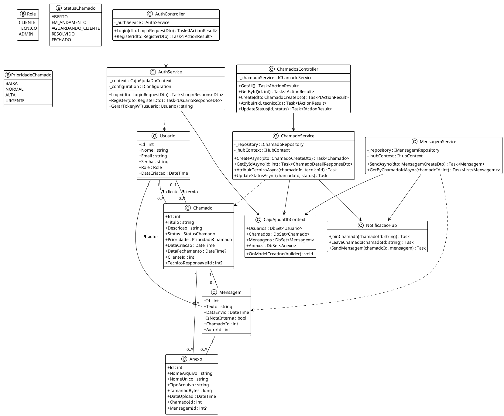

# 4. DIAGRAMA DE CLASSES GERAL DO SISTEMA

## 4.1 DESCRIÇÃO DAS CLASSES PRINCIPAIS

O sistema CajuAjuda foi desenvolvido seguindo os princípios da Programação Orientada a Objetos, com separação clara de responsabilidades através de camadas (Models, Services, Controllers, Repositories).

---

### **CAMADA DE MODELO (Models)**

#### **Classe: Usuario**
```csharp
public class Usuario
{
    // Propriedades
    public int Id { get; set; }
    public string Nome { get; set; }
    public string Email { get; set; }
    public string Senha { get; set; }  // Hash bcrypt
    public Role Role { get; set; }     // Cliente, Tecnico, Admin
    public DateTime DataCriacao { get; set; }
    
    // Relacionamentos (Navegação)
    public ICollection<Chamado> ChamadosCliente { get; set; }
    public ICollection<Chamado> ChamadosTecnico { get; set; }
    public ICollection<Mensagem> Mensagens { get; set; }
}
```

**Responsabilidades**: Representar um usuário do sistema  
**Relacionamentos**: 
- 1:N com Chamado (como Cliente)
- 1:N com Chamado (como Técnico)
- 1:N com Mensagem

---

#### **Classe: Chamado**
```csharp
public class Chamado
{
    // Propriedades
    public int Id { get; set; }
    public string Titulo { get; set; }
    public string Descricao { get; set; }
    public StatusChamado Status { get; set; }        // Enum
    public PrioridadeChamado Prioridade { get; set; } // Enum
    public DateTime DataCriacao { get; set; }
    public DateTime? DataFechamento { get; set; }
    
    // Chaves Estrangeiras
    public int ClienteId { get; set; }
    public int? TecnicoResponsavelId { get; set; }
    
    // Relacionamentos (Navegação)
    public Usuario Cliente { get; set; }
    public Usuario TecnicoResponsavel { get; set; }
    public ICollection<Mensagem> Mensagens { get; set; }
    public ICollection<Anexo> Anexos { get; set; }
}
```

**Responsabilidades**: Representar um ticket de suporte  
**Relacionamentos**:
- N:1 com Usuario (Cliente) - obrigatório
- N:1 com Usuario (Técnico) - opcional
- 1:N com Mensagem
- 1:N com Anexo

---

#### **Classe: Mensagem**
```csharp
public class Mensagem
{
    // Propriedades
    public int Id { get; set; }
    public string Texto { get; set; }
    public DateTime DataEnvio { get; set; }
    public bool IsNotaInterna { get; set; }
    
    // Chaves Estrangeiras
    public int ChamadoId { get; set; }
    public int AutorId { get; set; }
    
    // Relacionamentos (Navegação)
    public Chamado Chamado { get; set; }
    public Usuario Autor { get; set; }
    public ICollection<Anexo> Anexos { get; set; }
}
```

**Responsabilidades**: Representar uma mensagem do chat  
**Relacionamentos**:
- N:1 com Chamado
- N:1 com Usuario (Autor)
- 1:N com Anexo

---

#### **Classe: Anexo**
```csharp
public class Anexo
{
    // Propriedades
    public int Id { get; set; }
    public string NomeArquivo { get; set; }
    public string NomeUnico { get; set; }  // GUID no servidor
    public string TipoArquivo { get; set; } // MIME type
    public long TamanhoBytes { get; set; }
    public DateTime DataUpload { get; set; }
    
    // Chaves Estrangeiras
    public int ChamadoId { get; set; }
    public int? MensagemId { get; set; }
    
    // Relacionamentos (Navegação)
    public Chamado Chamado { get; set; }
    public Mensagem Mensagem { get; set; }
}
```

**Responsabilidades**: Representar um arquivo anexado  
**Relacionamentos**:
- N:1 com Chamado
- N:1 com Mensagem (opcional)

---

### **ENUMERAÇÕES (Enums)**

#### **Enum: Role**
```csharp
public enum Role
{
    CLIENTE = 0,
    TECNICO = 1,
    ADMIN = 2
}
```

#### **Enum: StatusChamado**
```csharp
public enum StatusChamado
{
    ABERTO = 0,
    EM_ANDAMENTO = 1,
    AGUARDANDO_CLIENTE = 2,
    RESOLVIDO = 3,
    FECHADO = 4
}
```

#### **Enum: PrioridadeChamado**
```csharp
public enum PrioridadeChamado
{
    BAIXA = 0,
    NORMAL = 1,
    ALTA = 2,
    URGENTE = 3
}
```

---

### **CAMADA DE SERVIÇOS (Services)**

#### **Classe: AuthService**
```csharp
public class AuthService : IAuthService
{
    private readonly CajuAjudaDbContext _context;
    private readonly IConfiguration _configuration;
    
    // Construtor com Injeção de Dependência
    public AuthService(CajuAjudaDbContext context, IConfiguration configuration)
    {
        _context = context;
        _configuration = configuration;
    }
    
    // Métodos Públicos
    public async Task<LoginResponseDto> Login(LoginRequestDto dto);
    public async Task<UsuarioResponseDto> Register(RegisterDto dto);
    public string GerarTokenJWT(Usuario usuario);
    private bool VerificarSenha(string senha, string hash);
}
```

**Responsabilidades**: Gerenciar autenticação e autorização  
**Dependências**: CajuAjudaDbContext, IConfiguration

---

#### **Classe: ChamadoService**
```csharp
public class ChamadoService : IChamadoService
{
    private readonly IChamadoRepository _chamadoRepository;
    private readonly IUsuarioRepository _usuarioRepository;
    private readonly IHubContext<NotificacaoHub> _hubContext;
    
    // Construtor
    public ChamadoService(
        IChamadoRepository chamadoRepository,
        IUsuarioRepository usuarioRepository,
        IHubContext<NotificacaoHub> hubContext)
    {
        _chamadoRepository = chamadoRepository;
        _usuarioRepository = usuarioRepository;
        _hubContext = hubContext;
    }
    
    // Métodos Públicos
    public async Task<Chamado> CreateAsync(ChamadoCreateDto dto, string clienteEmail);
    public async Task<List<Chamado>> GetDisponiveisAsync();
    public async Task<List<Chamado>> GetEmAndamentoAsync(int tecnicoId);
    public async Task<ChamadoDetailResponseDto> GetByIdAsync(int id);
    public async Task AtribuirTecnicoAsync(int chamadoId, int tecnicoId);
    public async Task UpdateStatusAsync(int chamadoId, StatusChamado novoStatus);
}
```

**Responsabilidades**: Lógica de negócio de chamados  
**Dependências**: Repositories, SignalR Hub

---

#### **Classe: MensagemService**
```csharp
public class MensagemService : IMensagemService
{
    private readonly IMensagemRepository _mensagemRepository;
    private readonly IHubContext<NotificacaoHub> _hubContext;
    
    // Construtor
    public MensagemService(
        IMensagemRepository mensagemRepository,
        IHubContext<NotificacaoHub> hubContext)
    {
        _mensagemRepository = mensagemRepository;
        _hubContext = hubContext;
    }
    
    // Métodos Públicos
    public async Task<Mensagem> SendAsync(MensagemCreateDto dto, int autorId);
    public async Task<List<Mensagem>> GetByChamadoIdAsync(int chamadoId);
    private async Task NotificarNovaM ensagemAsync(int chamadoId, Mensagem mensagem);
}
```

**Responsabilidades**: Gerenciar mensagens e notificações em tempo real  
**Dependências**: MensagemRepository, SignalR Hub

---

### **CAMADA DE CONTROLLERS**

#### **Classe: AuthController**
```csharp
[ApiController]
[Route("api/[controller]")]
public class AuthController : ControllerBase
{
    private readonly IAuthService _authService;
    
    public AuthController(IAuthService authService)
    {
        _authService = authService;
    }
    
    [HttpPost("login")]
    public async Task<IActionResult> Login([FromBody] LoginRequestDto dto);
    
    [HttpPost("register")]
    public async Task<IActionResult> Register([FromBody] RegisterDto dto);
}
```

**Responsabilidades**: Endpoint de autenticação  
**Rotas**: POST /api/auth/login, POST /api/auth/register

---

#### **Classe: ChamadosController**
```csharp
[ApiController]
[Route("api/[controller]")]
[Authorize]
public class ChamadosController : ControllerBase
{
    private readonly IChamadoService _chamadoService;
    
    public ChamadosController(IChamadoService chamadoService)
    {
        _chamadoService = chamadoService;
    }
    
    [HttpGet]
    public async Task<IActionResult> GetAll();
    
    [HttpGet("{id}")]
    public async Task<IActionResult> GetById(int id);
    
    [HttpPost]
    public async Task<IActionResult> Create([FromBody] ChamadoCreateDto dto);
    
    [HttpPut("{id}/atribuir")]
    public async Task<IActionResult> Atribuir(int id, [FromBody] int tecnicoId);
    
    [HttpPut("{id}/status")]
    public async Task<IActionResult> UpdateStatus(int id, [FromBody] StatusChamado status);
}
```

**Responsabilidades**: Endpoints CRUD de chamados  
**Autenticação**: JWT Bearer Token obrigatório

---

### **CAMADA DE REPOSITÓRIOS (Repositories)**

#### **Classe: ChamadoRepository**
```csharp
public class ChamadoRepository : IChamadoRepository
{
    private readonly CajuAjudaDbContext _context;
    
    public ChamadoRepository(CajuAjudaDbContext context)
    {
        _context = context;
    }
    
    public async Task<Chamado> GetByIdAsync(int id);
    public async Task<List<Chamado>> GetAllAsync();
    public async Task<Chamado> AddAsync(Chamado chamado);
    public async Task UpdateAsync(Chamado chamado);
    public async Task DeleteAsync(int id);
    public async Task<List<Chamado>> GetByClienteIdAsync(int clienteId);
    public async Task<List<Chamado>> GetByTecnicoIdAsync(int tecnicoId);
}
```

**Responsabilidades**: Acesso a dados de chamados  
**Padrão**: Repository Pattern

---

### **CAMADA DE DADOS (Data)**

#### **Classe: CajuAjudaDbContext**
```csharp
public class CajuAjudaDbContext : DbContext
{
    public CajuAjudaDbContext(DbContextOptions<CajuAjudaDbContext> options)
        : base(options) { }
    
    // DbSets (Tabelas)
    public DbSet<Usuario> Usuarios { get; set; }
    public DbSet<Chamado> Chamados { get; set; }
    public DbSet<Mensagem> Mensagens { get; set; }
    public DbSet<Anexo> Anexos { get; set; }
    
    protected override void OnModelCreating(ModelBuilder modelBuilder)
    {
        // Configurações de relacionamentos, índices, constraints
    }
}
```

**Responsabilidades**: Contexto do Entity Framework Core  
**Padrão**: Unit of Work

---

### **SIGNALR HUB**

#### **Classe: NotificacaoHub**
```csharp
public class NotificacaoHub : Hub
{
    public async Task JoinChamado(string chamadoId)
    {
        await Groups.AddToGroupAsync(Context.ConnectionId, $"chamado_{chamadoId}");
    }
    
    public async Task LeaveChamado(string chamadoId)
    {
        await Groups.RemoveFromGroupAsync(Context.ConnectionId, $"chamado_{chamadoId}");
    }
    
    public async Task SendMensagem(string chamadoId, object mensagem)
    {
        await Clients.Group($"chamado_{chamadoId}").SendAsync("NovaMensagem", mensagem);
    }
}
```

**Responsabilidades**: Comunicação em tempo real via WebSocket  
**Eventos**: NovaMensagem, StatusAtualizado

---

## 4.2 DIAGRAMA DE CLASSES PLANTUML

**Nota**: Para visualizar, cole em https://www.plantuml.com/plantuml/uml/



---

## 4.3 MULTIPLICIDADES DOS RELACIONAMENTOS

| Relacionamento | Multiplicidade | Descrição |
|---------------|---------------|-----------|
| Usuario → Chamado (Cliente) | 1:N | Um cliente cria vários chamados |
| Usuario → Chamado (Técnico) | 0..1:N | Um técnico pode ter vários chamados |
| Chamado → Mensagem | 1:N | Um chamado tem várias mensagens |
| Usuario → Mensagem | 1:N | Um usuário envia várias mensagens |
| Mensagem → Anexo | 1:N | Uma mensagem pode ter vários anexos |
| Chamado → Anexo | 1:N | Um chamado pode ter vários anexos |

---

## 4.4 PADRÕES DE PROJETO APLICADOS

1. **Repository Pattern**: Camada de abstração para acesso a dados
2. **Service Layer Pattern**: Lógica de negócio separada dos controllers
3. **Dependency Injection**: Injeção de dependências via construtor
4. **DTO Pattern**: Data Transfer Objects para comunicação API
5. **MVC Pattern**: Model-View-Controller no backend
6. **MVVM Pattern**: Model-View-ViewModel no Desktop MAUI
