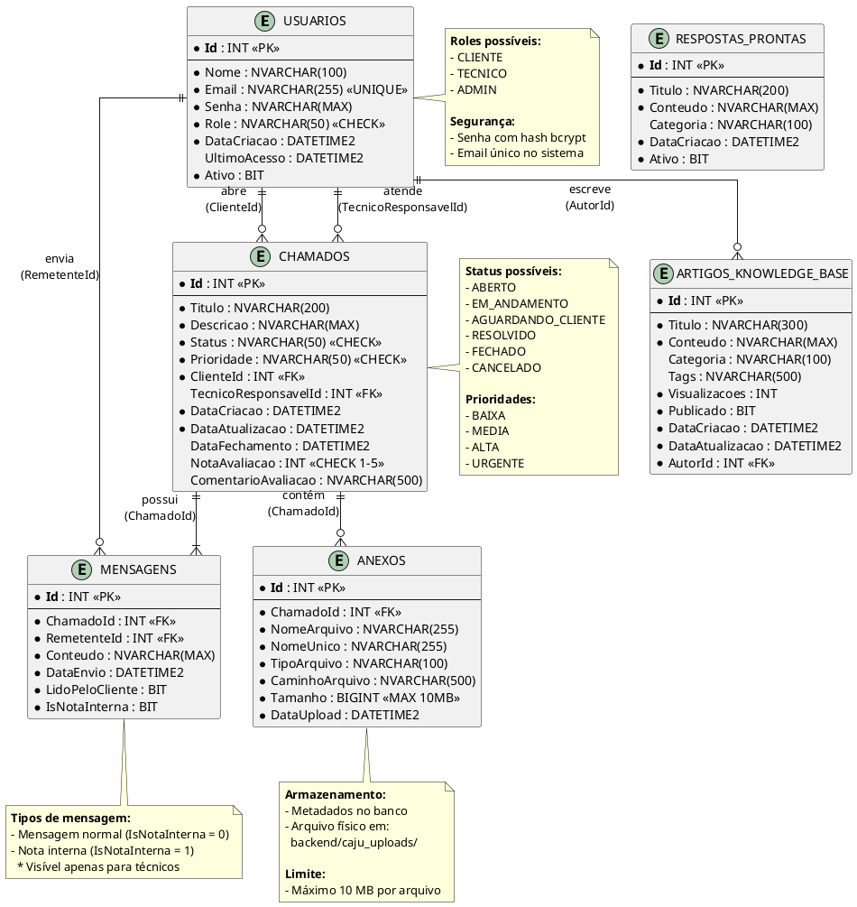

# 7. MODELO ENTIDADE-RELACIONAMENTO (MER)

## 7.1 INTRODUÇÃO

O Modelo Entidade-Relacionamento (MER) é uma representação abstrata da estrutura do banco de dados, mostrando as entidades (tabelas), seus atributos (colunas) e os relacionamentos entre elas.

---

## 7.2 ENTIDADES E ATRIBUTOS

### **Entidade: USUARIOS**

Representa todos os usuários do sistema (Clientes, Técnicos e Administradores).

| Atributo | Tipo | Restrições | Descrição |
|----------|------|------------|-----------|
| **Id** (PK) | INT | NOT NULL, IDENTITY | Identificador único |
| Nome | NVARCHAR(100) | NOT NULL | Nome completo |
| Email | NVARCHAR(255) | NOT NULL, UNIQUE | Email único |
| Senha | NVARCHAR(MAX) | NOT NULL | Hash bcrypt |
| Role | NVARCHAR(50) | NOT NULL | CLIENTE/TECNICO/ADMIN |
| DataCriacao | DATETIME2 | NOT NULL, DEFAULT GETDATE() | Data de cadastro |
| UltimoAcesso | DATETIME2 | NULL | Último login |
| Ativo | BIT | NOT NULL, DEFAULT 1 | Status da conta |

**Restrições**:
- Email deve ser único no sistema
- Role deve ser um dos valores: CLIENTE, TECNICO, ADMIN
- Senha deve ter no mínimo 6 caracteres (validado na aplicação)

---

### **Entidade: CHAMADOS**

Representa os tickets/chamados de suporte abertos pelos clientes.

| Atributo | Tipo | Restrições | Descrição |
|----------|------|------------|-----------|
| **Id** (PK) | INT | NOT NULL, IDENTITY | Identificador único |
| Titulo | NVARCHAR(200) | NOT NULL | Título do chamado |
| Descricao | NVARCHAR(MAX) | NOT NULL | Descrição detalhada |
| Status | NVARCHAR(50) | NOT NULL | Status atual |
| Prioridade | NVARCHAR(50) | NOT NULL | Nível de prioridade |
| **ClienteId** (FK) | INT | NOT NULL | Quem abriu o chamado |
| **TecnicoResponsavelId** (FK) | INT | NULL | Técnico atribuído |
| DataCriacao | DATETIME2 | NOT NULL, DEFAULT GETDATE() | Data de abertura |
| DataAtualizacao | DATETIME2 | NOT NULL, DEFAULT GETDATE() | Última modificação |
| DataFechamento | DATETIME2 | NULL | Data de fechamento |
| NotaAvaliacao | INT | NULL, CHECK 1-5 | Avaliação (1-5 estrelas) |
| ComentarioAvaliacao | NVARCHAR(500) | NULL | Comentário da avaliação |

**Restrições**:
- Status: ABERTO, EM_ANDAMENTO, AGUARDANDO_CLIENTE, RESOLVIDO, FECHADO, CANCELADO
- Prioridade: BAIXA, MEDIA, ALTA, URGENTE
- NotaAvaliacao entre 1 e 5 (se preenchido)
- ClienteId referencia Usuarios (obrigatório)
- TecnicoResponsavelId referencia Usuarios (opcional)

---

### **Entidade: MENSAGENS**

Representa as mensagens trocadas no chat de cada chamado.

| Atributo | Tipo | Restrições | Descrição |
|----------|------|------------|-----------|
| **Id** (PK) | INT | NOT NULL, IDENTITY | Identificador único |
| **ChamadoId** (FK) | INT | NOT NULL | Chamado ao qual pertence |
| **RemetenteId** (FK) | INT | NOT NULL | Quem enviou |
| Conteudo | NVARCHAR(MAX) | NOT NULL | Texto da mensagem |
| DataEnvio | DATETIME2 | NOT NULL, DEFAULT GETDATE() | Quando foi enviada |
| LidoPeloCliente | BIT | NOT NULL, DEFAULT 0 | Marcador de leitura |
| IsNotaInterna | BIT | NOT NULL, DEFAULT 0 | Visível apenas p/ técnicos |

**Restrições**:
- ChamadoId referencia Chamados (obrigatório)
- RemetenteId referencia Usuarios (obrigatório)
- Conteúdo não pode ser vazio
- Notas internas só são visíveis para TECNICO e ADMIN

---

### **Entidade: ANEXOS**

Armazena metadados dos arquivos anexados aos chamados.

| Atributo | Tipo | Restrições | Descrição |
|----------|------|------------|-----------|
| **Id** (PK) | INT | NOT NULL, IDENTITY | Identificador único |
| **ChamadoId** (FK) | INT | NOT NULL | Chamado ao qual pertence |
| NomeArquivo | NVARCHAR(255) | NOT NULL | Nome original |
| NomeUnico | NVARCHAR(255) | NOT NULL | Nome no filesystem |
| TipoArquivo | NVARCHAR(100) | NOT NULL | MIME type |
| CaminhoArquivo | NVARCHAR(500) | NOT NULL | Path completo |
| Tamanho | BIGINT | NOT NULL, CHECK > 0 | Tamanho em bytes |
| DataUpload | DATETIME2 | NOT NULL, DEFAULT GETDATE() | Data do upload |

**Restrições**:
- ChamadoId referencia Chamados (obrigatório)
- Tamanho máximo: 10 MB (10.485.760 bytes)
- NomeUnico deve ser único no sistema (gerado com GUID)

---

### **Entidade: RESPOSTAS_PRONTAS**

Templates de respostas rápidas para os técnicos.

| Atributo | Tipo | Restrições | Descrição |
|----------|------|------------|-----------|
| **Id** (PK) | INT | NOT NULL, IDENTITY | Identificador único |
| Titulo | NVARCHAR(200) | NOT NULL | Nome da resposta |
| Conteudo | NVARCHAR(MAX) | NOT NULL | Texto do template |
| Categoria | NVARCHAR(100) | NULL | Categoria (opcional) |
| DataCriacao | DATETIME2 | NOT NULL, DEFAULT GETDATE() | Data de criação |
| Ativo | BIT | NOT NULL, DEFAULT 1 | Se está disponível |

---

### **Entidade: ARTIGOS_KNOWLEDGE_BASE**

Artigos da base de conhecimento pública.

| Atributo | Tipo | Restrições | Descrição |
|----------|------|------------|-----------|
| **Id** (PK) | INT | NOT NULL, IDENTITY | Identificador único |
| Titulo | NVARCHAR(300) | NOT NULL | Título do artigo |
| Conteudo | NVARCHAR(MAX) | NOT NULL | Conteúdo completo |
| Categoria | NVARCHAR(100) | NULL | Categoria do artigo |
| Tags | NVARCHAR(500) | NULL | Tags separadas por vírgula |
| Visualizacoes | INT | NOT NULL, DEFAULT 0 | Contador de views |
| Publicado | BIT | NOT NULL, DEFAULT 0 | Se está visível |
| DataCriacao | DATETIME2 | NOT NULL, DEFAULT GETDATE() | Data de criação |
| DataAtualizacao | DATETIME2 | NOT NULL, DEFAULT GETDATE() | Última edição |
| **AutorId** (FK) | INT | NOT NULL | Quem criou o artigo |

**Restrições**:
- AutorId referencia Usuarios (obrigatório)
- Apenas artigos com Publicado = 1 são visíveis aos clientes

---

## 7.3 RELACIONAMENTOS

### **1. USUARIOS → CHAMADOS (Cliente)**

- **Tipo**: 1:N (Um usuário pode ter muitos chamados)
- **Cardinalidade**: (1,N) → (0,N)
- **Descrição**: Um cliente pode abrir vários chamados. Todo chamado deve ter um cliente.
- **FK**: Chamados.ClienteId → Usuarios.Id
- **Regra de Exclusão**: ON DELETE NO ACTION (não pode excluir usuário com chamados)

### **2. USUARIOS → CHAMADOS (Técnico)**

- **Tipo**: 1:N (Um técnico pode ser responsável por muitos chamados)
- **Cardinalidade**: (0,1) → (0,N)
- **Descrição**: Um técnico pode ser atribuído a vários chamados. Um chamado pode não ter técnico.
- **FK**: Chamados.TecnicoResponsavelId → Usuarios.Id
- **Regra de Exclusão**: ON DELETE NO ACTION

### **3. CHAMADOS → MENSAGENS**

- **Tipo**: 1:N (Um chamado tem muitas mensagens)
- **Cardinalidade**: (1,1) → (1,N)
- **Descrição**: Todo chamado tem pelo menos uma mensagem (a descrição inicial). Uma mensagem pertence a apenas um chamado.
- **FK**: Mensagens.ChamadoId → Chamados.Id
- **Regra de Exclusão**: ON DELETE CASCADE (se excluir chamado, exclui mensagens)

### **4. USUARIOS → MENSAGENS**

- **Tipo**: 1:N (Um usuário envia muitas mensagens)
- **Cardinalidade**: (1,1) → (0,N)
- **Descrição**: Toda mensagem tem um remetente (cliente ou técnico). Um usuário pode enviar várias mensagens.
- **FK**: Mensagens.RemetenteId → Usuarios.Id
- **Regra de Exclusão**: ON DELETE NO ACTION

### **5. CHAMADOS → ANEXOS**

- **Tipo**: 1:N (Um chamado pode ter muitos anexos)
- **Cardinalidade**: (1,1) → (0,N)
- **Descrição**: Um chamado pode ter vários arquivos anexados. Um anexo pertence a apenas um chamado.
- **FK**: Anexos.ChamadoId → Chamados.Id
- **Regra de Exclusão**: ON DELETE CASCADE (se excluir chamado, exclui anexos)

### **6. USUARIOS → ARTIGOS_KNOWLEDGE_BASE**

- **Tipo**: 1:N (Um autor pode criar muitos artigos)
- **Cardinalidade**: (1,1) → (0,N)
- **Descrição**: Todo artigo tem um autor (técnico ou admin). Um usuário pode criar vários artigos.
- **FK**: ArtigosKnowledgeBase.AutorId → Usuarios.Id
- **Regra de Exclusão**: ON DELETE NO ACTION

---

## 7.4 DIAGRAMA ENTIDADE-RELACIONAMENTO (PLANTUM)



---

## 7.5 DIAGRAMA SIMPLIFICADO (NOTAÇÃO CHEN)

```
                  ┌──────────────┐
                  │   USUARIOS   │
                  └──────────────┘
                         │
                         │1
                         │
           ┌─────────────┼─────────────┐
           │             │             │
           │abre         │atende       │escreve
           │             │             │
          N│            N│            N│
     ┌──────────┐  ┌──────────┐  ┌──────────────────┐
     │ CHAMADOS │  │ CHAMADOS │  │ ARTIGOS_KB       │
     └──────────┘  └──────────┘  └──────────────────┘
          │             │
          │1            │1
          │             │
    ┌─────┴─────┐       │envia
    │           │       │
   N│          N│      N│
┌──────────┐ ┌──────┐ ┌──────────┐
│MENSAGENS │ │ANEXOS│ │MENSAGENS │
└──────────┘ └──────┘ └──────────┘
```

---

## 7.6 TABELA DE CARDINALIDADES

| Relacionamento | Entidade A | Cardinalidade A | Entidade B | Cardinalidade B | Tipo |
|----------------|------------|-----------------|------------|-----------------|------|
| Cliente-Chamado | USUARIOS (Cliente) | 1 | CHAMADOS | N | 1:N |
| Técnico-Chamado | USUARIOS (Técnico) | 0..1 | CHAMADOS | N | 0..1:N |
| Chamado-Mensagem | CHAMADOS | 1 | MENSAGENS | N | 1:N |
| Remetente-Mensagem | USUARIOS | 1 | MENSAGENS | N | 1:N |
| Chamado-Anexo | CHAMADOS | 1 | ANEXOS | N | 1:N |
| Autor-Artigo | USUARIOS | 1 | ARTIGOS_KB | N | 1:N |

**Legenda**:
- **1**: Obrigatório (exatamente um)
- **N**: Muitos (0 ou mais)
- **0..1**: Opcional (zero ou um)

---

## 7.7 REGRAS DE INTEGRIDADE REFERENCIAL

### **DELETE Behaviors**

| Relacionamento | FK Table | ON DELETE | Justificativa |
|----------------|----------|-----------|---------------|
| Usuarios → Chamados (Cliente) | Chamados | NO ACTION | Preservar histórico de chamados |
| Usuarios → Chamados (Técnico) | Chamados | NO ACTION | Preservar histórico de atendimento |
| Chamados → Mensagens | Mensagens | CASCADE | Mensagens pertencem ao chamado |
| Usuarios → Mensagens | Mensagens | NO ACTION | Preservar histórico de quem enviou |
| Chamados → Anexos | Anexos | CASCADE | Anexos pertencem ao chamado |
| Usuarios → Artigos | Artigos | NO ACTION | Preservar autoria do artigo |

### **UPDATE Behaviors**

Todas as FK utilizam **ON UPDATE CASCADE** (padrão do SQL Server).

---

## 7.8 DICIONÁRIO DE DADOS

### **Tipos de Dados Padronizados**

| Tipo C# | Tipo SQL Server | Uso |
|---------|----------------|------|
| int | INT | IDs e números inteiros |
| string (curto) | NVARCHAR(N) | Textos pequenos (N ≤ 500) |
| string (longo) | NVARCHAR(MAX) | Textos grandes e JSON |
| DateTime | DATETIME2(7) | Datas e timestamps |
| bool | BIT | Flags booleanos |
| long | BIGINT | Números grandes (tamanho de arquivo) |

### **Convenções de Nomenclatura**

✅ **Tabelas**: PascalCase, singular (Usuarios, Chamados)  
✅ **Colunas**: PascalCase (ClienteId, DataCriacao)  
✅ **PKs**: Sempre "Id" (INT IDENTITY)  
✅ **FKs**: NomeEntidadeId (ClienteId, ChamadoId)  
✅ **Índices**: IX_Tabela_Coluna  
✅ **Constraints**: CK_Tabela_Coluna  

---

## 7.9 NORMALIZAÇÃO

O banco de dados está na **3ª Forma Normal (3FN)**:

### **1FN (Primeira Forma Normal)**
✅ Todos os atributos são atômicos (sem listas ou arrays)  
✅ Não há grupos repetitivos  

### **2FN (Segunda Forma Normal)**
✅ Todos os atributos não-chave dependem totalmente da chave primária  
✅ Não há dependências parciais  

### **3FN (Terceira Forma Normal)**
✅ Não há dependências transitivas  
✅ Atributos não-chave dependem apenas da PK, não de outros atributos  

**Exemplo de Normalização Aplicada**:

❌ **Antes (Não normalizado)**:
```
Chamados: Id, Titulo, ClienteNome, ClienteEmail, TecnicoNome, TecnicoEmail
```

✅ **Depois (Normalizado - 3FN)**:
```
Usuarios: Id, Nome, Email
Chamados: Id, Titulo, ClienteId, TecnicoId
```

---

## 7.10 CONSIDERAÇÕES FINAIS

### **Vantagens do Modelo**

✅ **Integridade Referencial**: FKs garantem consistência dos dados  
✅ **Normalização**: Reduz redundância e anomalias de atualização  
✅ **Flexibilidade**: Fácil adicionar novos campos ou tabelas  
✅ **Performance**: Índices otimizam queries frequentes  
✅ **Auditoria**: Campos de data registram histórico de mudanças  

### **Possíveis Melhorias Futuras**

🔄 **Tabela de Auditoria**: Log de todas as alterações  
🔄 **Tabela de Categorias**: Normalizar categorias em tabela separada  
🔄 **Tabela de Tags**: Sistema de tags mais robusto  
🔄 **Tabela de Notificações**: Histórico de notificações enviadas  
🔄 **Soft Delete**: Não excluir fisicamente, apenas marcar como excluído  

---

**Resumo**: O MER documenta as 6 entidades principais do sistema (Usuarios, Chamados, Mensagens, Anexos, RespostasProntas, ArtigosKnowledgeBase) e seus 6 relacionamentos, todos respeitando as regras de normalização até a 3FN e com integridade referencial garantida por constraints.
